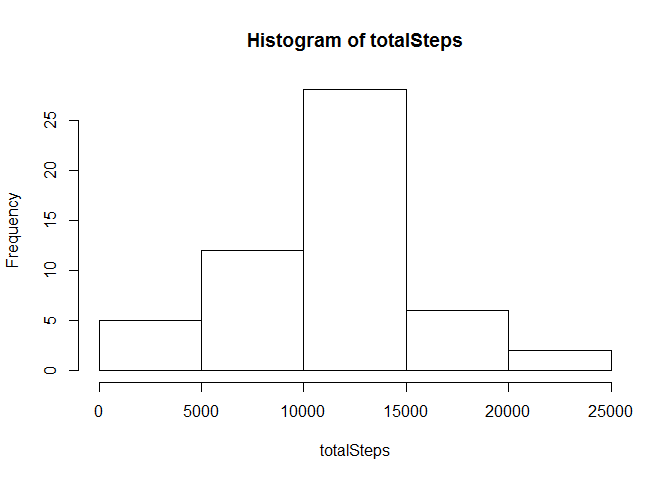
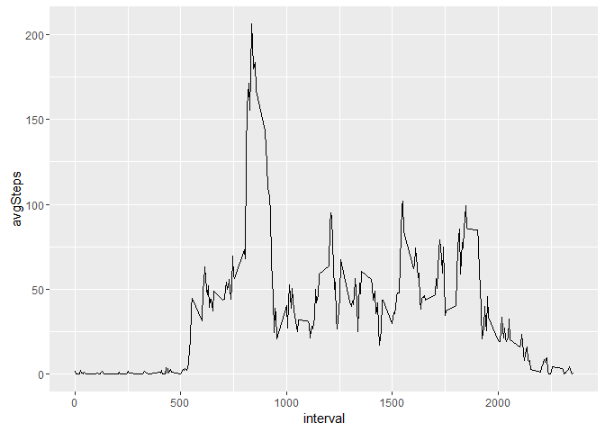
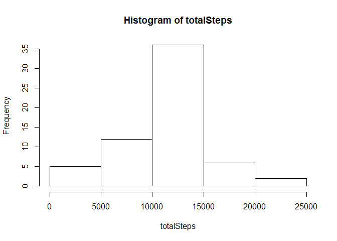
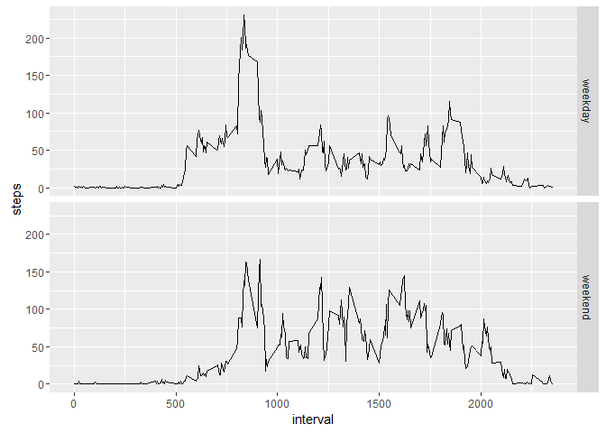

# Reproducible Research: Peer Assessment 1


## Loading and preprocessing the data
Code for reading in the dataset and/or processing the data


```r
unzip("./activity.zip", "activity.csv")
stepData <- read.csv("activity.csv")
stepData$date <- as.Date(stepData$date, "%Y-%m-%d")
```

#show first few rows of data

```r
head(stepData)
```

```
##   steps       date interval
## 1    NA 2012-10-01        0
## 2    NA 2012-10-01        5
## 3    NA 2012-10-01       10
## 4    NA 2012-10-01       15
## 5    NA 2012-10-01       20
## 6    NA 2012-10-01       25
```

## What is mean total number of steps taken per day?

Total Steps

```r
totalSteps <- tapply(stepData$steps[!is.na(stepData$steps)], stepData$date[!is.na(stepData$steps)],sum)
```

Histogram of the total number of steps taken each day


```r
hist(totalSteps)
```

<!-- -->

Mean number of steps taken each day


```r
mean(totalSteps,na.rm=TRUE)
```

```
## [1] 10766.19
```

Median number of steps taken each day


```r
median(totalSteps,na.rm=TRUE)
```

```
## [1] 10765
```

## What is the average daily activity pattern?

Time series plot of the average number of steps taken


```r
library(ggplot2)  
avgSteps<-tapply(stepData$steps,stepData$interval,mean,na.rm=TRUE)
interval<-levels(factor(stepData$interval))
interval<-as.numeric(interval)
qplot(interval,avgSteps,geom = "line")
```

<!-- -->

The 5-minute interval that, on average, contains the maximum number of steps


```r
names(avgSteps)[avgSteps==max(avgSteps)]
```

```
## [1] "835"
```

## Imputing missing values

Code to describe and show a strategy for imputing missing data

Substituding all the values with the mean and mediam


```r
library(dplyr)
meanSteps<-data.frame(interval=names(avgSteps),mean=avgSteps)
meanSteps<-avgSteps[as.character(stepData$interval)]
stepData<-mutate(stepData,meanSteps=meanSteps)
stepData$steps<-as.numeric(stepData$steps)
```


```
##   steps       date interval meanSteps
## 1    NA 2012-10-01        0 1.7169811
## 2    NA 2012-10-01        5 0.3396226
## 3    NA 2012-10-01       10 0.1320755
## 4    NA 2012-10-01       15 0.1509434
## 5    NA 2012-10-01       20 0.0754717
## 6    NA 2012-10-01       25 2.0943396
```


```r
stepData[is.na(stepData$steps),1]<-stepData[is.na(stepData$steps),4]
```


```
##       steps       date interval meanSteps
## 1 1.7169811 2012-10-01        0 1.7169811
## 2 0.3396226 2012-10-01        5 0.3396226
## 3 0.1320755 2012-10-01       10 0.1320755
## 4 0.1509434 2012-10-01       15 0.1509434
## 5 0.0754717 2012-10-01       20 0.0754717
## 6 2.0943396 2012-10-01       25 2.0943396
```

Histogram of the total number of steps taken each day after missing values are imputed


```r
totalSteps<-tapply(stepData$steps,stepData$date,sum)
hist(totalSteps)
```

<!-- -->


## Are there differences in activity patterns between weekdays and weekends?

Panel plot comparing the average number of steps taken per 5-minute interval across weekdays and weekends


```r
date<-as.Date(stepData$date)

weekday<-weekdays(date)
isWeekend<-weekday %in% c("Sunday","Saturday")
weekday[isWeekend]<-'weekend'
weekday[!isWeekend]<-'weekday'
weekday<-as.factor(weekday)

stepData<-mutate(stepData,weekday=weekday)
stepsWeekday<-summarize(group_by(stepData,weekday,interval),steps=mean(steps))
qplot(interval,steps,data = stepsWeekday,geom="line",facets = "weekday~.")
```

<!-- -->

It seems that there is there is more activity on the weekends. 
